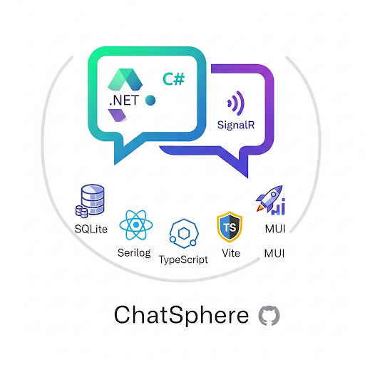

# NotT3Chat: The C# Answer to the T3 Stack
 


Welcome to **NotT3Chat**, a fully-featured, real-time chat application built for the [cloneathon.t3.chat](https://cloneathon.t3.chat). This project serves as a testament to the raw power and elegance of C# and ASP.NET Core, proving that you don't need TypeScript to build amazing, modern web applications. (Sorry, Theo.)

*   **📱 Mobile-Optimized Experience:** The entire application is optimized for mobile devices. Features include:
  * Prevents unwanted page scrolling and zooming on input focus
  * Input area automatically adjusts position when the mobile keyboard is shown
  * Responsive layout and touch-friendly controls
  * Mobile console logger for debugging on iPhone and other devices

> **🔥 NEW: Now powered by Azure OpenAI with credential-based authentication!**  
> See [Azure OpenAI Setup Guide](AZURE_SETUP.md) for configuration details.

> Too much bullshit just take me to [Getting Started](#-getting-started).

### Check out the demo!


---

## 🤔 Why?

Why build another chat app? Two reasons:

1.  To participate in the T3 Clone-a-thon and have some fun.
2.  To lovingly poke at the T3 stack and demonstrate that a robust, type-safe, and high-performance application can be built with the glorious combination of **C# on the backend** and **TypeScript on the front**. It's a love letter to backend developers who appreciate strongly-typed languages and modern web development practices.

## ✨ Core Features

This is far from just a "hello world" chat. We've packed in some serious features:

*   **🤖 Azure OpenAI Integration:** Seamlessly integrated with Azure OpenAI services using credential-based authentication (no API keys required).
*   **🔍 Perplexity Search Integration:** Advanced search capabilities through Perplexity AI for comprehensive research and information retrieval.
*   **⚡ Blazing-Fast Real-Time Chat:** Built with the magic of **[SignalR](https://dotnet.microsoft.com/apps/aspnet/signalr)**, messages stream in real-time.
*   **🔄 Advanced Stream Resumption:** Did you close your browser tab mid-stream? No problem. Re-open the chat, and the stream will pick up right where it left off.
*   **🤝 Multi-Session Sync:** Open the same chat in multiple windows or on different devices, and watch the messages stream in perfect sync across all of them.
*   **📝 Resizable Message Input:** Drag the top edge of the message input area to resize it for comfortable long-form writing - no height limits!
*   **🔐 Authentication:** A login system to keep your chats private.
*   **📜 Chat History:** All your conversations are saved and can be revisited anytime.
*   **🌳 Conversation Branching:** Fork conversations at any point to explore different discussion paths.
*   **🔄 Message Regeneration:** Regenerate AI responses with different models or parameters.
*   **📊 Comprehensive Logging:** Detailed logging with Serilog for better debugging and monitoring.

## 🛠️ Tech Stack & How It Was Built

This project was a collaboration between human and machine.

### Backend


The backend was primarily built by me, with some expert consulting from **Sonnet 4**. The goal was a lean, powerful, and scalable foundation using ASP.NET Core 9. The application now uses **Azure OpenAI** services with credential-based authentication for secure, enterprise-grade AI integration, plus **Perplexity AI** for advanced search capabilities. Features comprehensive logging with **Serilog** for better debugging and monitoring.

### Frontend


The UI was mostly crafted with the help of **Claude Code**. Originally built in JavaScript, it has since been converted to **TypeScript** for better type safety and developer experience. It's a clean, component-based React app built with Vite and styled with MUI.

---

## 🚀 Getting Started

### Prerequisites

*   [.NET SDK 9.0](https://dotnet.microsoft.com/download/dotnet/9.0)
    *   On Ubuntu 22+: `apt update && apt install dotnet-sdk-9.0`
*   [Node.js v18+](https://nodejs.org/)
*   [pnpm](https://pnpm.io/) (recommended package manager)

### 1. Launching the Backend

The backend runs on port 80 by default (configured via Kestrel in appsettings.json):
- **Both Development and Production**: `http://localhost:80`

**Configuration:**

The backend now uses Azure OpenAI with credential-based authentication. See the [Azure OpenAI Setup Guide](AZURE_SETUP.md) for detailed configuration instructions.

**Quick Setup:**

1. **Azure OpenAI Resource**: Create an Azure OpenAI resource and deploy your models
2. **Authentication**: Configure authentication (Azure CLI, Managed Identity, or Service Principal)
3. **Configuration**: Update `appsettings.json` with your Azure OpenAI endpoint and model names

```json
{
  "AzureOpenAI": {
    "Endpoint": "https://your-resource-name.openai.azure.com/",
    "Models": ["gpt-4o-mini", "gpt-4o", "gpt-35-turbo"],
    "TitleModel": "gpt-4o-mini"
  },
  "Perplexity": {
    "ApiKey": "your-perplexity-api-key-here" // Required for both search and streaming capabilities
  },
  "AllowedHosts": "*",
  "Kestrel": {
    "Endpoints": {
      "MyHttpEndpoint": {
        "Url": "http://0.0.0.0:80"
      }
    }
  }
}
```

**Debug Mode:**
```bash
dotnet run --project backend/NotT3ChatBackend.csproj
```
> **Note:** This runs on `http://localhost:80`. The first time you run this, it will create a `databse.dat` SQLite file. When running in debug it will seed it with a default user:
> - **Username:** `admin@example.com`
> - **Password:** `admin`

**Production Mode:**
```bash
# Build for production
dotnet publish backend/NotT3ChatBackend.csproj -c Release -o publish

# Run the published app (uses port 80 by default via Kestrel configuration)
dotnet publish/NotT3ChatBackend.dll

# Or specify a custom port:
dotnet publish/NotT3ChatBackend.dll --urls http://0.0.0.0:5555
```

> A few warnings: 
> 1. We use MemoryCache right now for synchronization, we will use Redis in the future but this means that it only works on a single server instance, no load balancer. 
> 2. Cors policy right now is any domain allowed, feel free to change it yourself. 
> 3. The password requirements are very minimal, feel free to change it yourself. 

### 2. Launching the Frontend

The frontend dev server runs on `http://localhost:5173` and will connect to the backend API on port 80.

```bash
# Navigate to the frontend directory
cd front-end

# Install dependencies using pnpm (recommended)
pnpm install

# Alternative: using npm if you prefer
# npm install

# Run the dev server (frontend will be available at http://localhost:5173)
VITE_API_URL=http://localhost:80 pnpm run dev

# Alternative with npm:
# VITE_API_URL=http://localhost:80 npm run dev
```
> You can also set `VITE_API_URL=http://localhost:80` in a `.env` file inside the `front-end` directory.

---

## 🗺️ Roadmap & Future Features

Here's a non-exhaustive list of what's planned when I get around to it:

- [ ] Attachments (files, images)
- [x] Better syntax highlighting for code blocks
- [ ] Even better syntax highlighting, with copy buttons
- [x] Branching conversations
- [x] Tools (Perplexity web search integration with streaming)
- [ ] Image generation
- [ ] Chat sharing via public links
- [ ] Bring Your Own Key (BYOK) for API providers
- [x] Regenerate message (or regenerate with a different model)
- [x] Delete chats
- [ ] Delete individual messages?
- [x] Intelligent, automatic naming for new chats
- [x] Resizable message input area with drag-to-resize functionality
- [ ] Search through threads
- [ ] Make it prettier?
- [ ] Thinking models
- [x] Comprehensive logging with proper source context

---

## 💻 Developer's Corner

Some notes on the current state of the codebase for aspiring contributors.

### Backend Philosophy
The backend is currently in a single `Program.cs` file. This is an intentional experiment in anticipation of .NET 10's enhanced support for single-file applications (`dotnet run app.cs`). We are going to split it into a more traditional file structure for clarity soon. It's a WIP!

### Frontend Styling Rules
To maintain consistency and code quality with TypeScript, we follow these styling rules:

1.  **Component Styling:** Use components from **MUI** whenever possible.
2.  **Class Names:** For multiple conditional class names on an element, use the `light-classnames` library.
3.  **No Inline Styles:** All styling should be done via class names in dedicated `.css` files. **No inline `style` or `sx` props.**
4.  **No `!important`:** If you feel the need to use `!important`, take a break, have some water, and refactor.
5.  **TypeScript First:** All new components should be written in TypeScript for better type safety and developer experience.

### Technical To-Do List

- [x] Graceful error handling (e.g., 429 Too Many Requests, content filter blocks). (More or less done, can always be improved)
- [x] Streamline adding new models via environment variables instead of code changes.
- [ ] Add configuration to easily switch between db providers (In-Memory, SQLite, PostgreSQL, etc.).
- [ ] Consider segmenting larger UI components into smaller, more focused ones.
- [ ] Add an easy way to specify a default user account via environment variables for local development.
- [x] Logging with proper source context and structured logging via Serilog
- [ ] Add configuration to move to redis for distributed cache for better synchronization & locking for actively streaming chats.
- [x] Fix general chat events to always stream (delete, title, new)
- [x] Perplexity AI integration for web search and research capabilities
- [x] TypeScript conversion for better type safety on the frontend

---

## 🤝 Contributing

Contributions are what make the open-source community such an amazing place to learn, inspire, and create. All contributions are more than welcome! Feel free to fork the repo, create a feature branch, and open a pull request.

## 📜 License

This project is licensed under the [MIT License](LICENSE.md).
